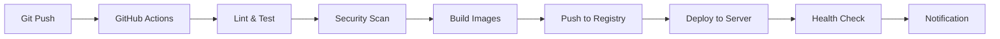

# 🚀 Dog Booking System - Infrastructure & CI/CD Documentation

## 📋 Overview

This document provides complete instructions for setting up the production-ready infrastructure and CI/CD pipeline for the Dog Booking System. The infrastructure includes Docker containerization, automated deployments, monitoring, and backup systems.

## 🏗️ Architecture

### Production Stack
- **Frontend**: Next.js with TypeScript (Docker)
- **Backend**: Laravel 10 with PHP 8.2 (Docker)
- **Database**: MariaDB 10.11 (Docker)
- **Cache/Sessions**: Redis 7 (Docker)
- **Web Server**: Nginx with SSL (Docker)
- **Monitoring**: Prometheus + Grafana (Docker)
- **Backup**: Automated S3 backups (Docker)

### Infrastructure Components
```
┌─────────────────┐    ┌─────────────────┐    ┌─────────────────┐
│   Nginx Proxy   │────│   Frontend      │    │   Backend       │
│   (SSL/HTTPS)   │    │   (Next.js)     │    │   (Laravel)     │
└─────────────────┘    └─────────────────┘    └─────────────────┘
         │                       │                       │
         └───────────────────────┼───────────────────────┘
                                 │
         ┌─────────────────┬─────┴─────┬─────────────────┐
         │                 │           │                 │
┌─────────────────┐ ┌─────────────────┐ ┌─────────────────┐
│    MariaDB      │ │     Redis       │ │   Monitoring    │
│   (Database)    │ │ (Cache/Sessions)│ │ (Grafana/Prom.) │
└─────────────────┘ └─────────────────┘ └─────────────────┘
```

## 🐳 Docker Setup

### Development Environment
```bash
# Start development environment
docker-compose up -d

# View logs
docker-compose logs -f

# Stop services
docker-compose down
```

### Production Environment
```bash
# Start production environment
docker-compose -f docker-compose.prod.yml up -d

# View status
docker-compose -f docker-compose.prod.yml ps

# Update application
cd /opt/dog-booking-system
git pull origin main
docker-compose -f docker-compose.prod.yml up -d --build
```

## 🚀 DigitalOcean Deployment

### Quick Setup
1. **Create DigitalOcean Droplet**
   - Ubuntu 22.04 LTS
   - Minimum: 2GB RAM, 2 vCPUs
   - Recommended: 4GB RAM, 2 vCPUs

2. **Run Deployment Script**
   ```bash
   # Download and run deployment script
   curl -fsSL https://raw.githubusercontent.com/yourusername/dog-booking-system/main/scripts/deploy.sh -o deploy.sh
   chmod +x deploy.sh
   sudo ./deploy.sh --domain yourdomain.com --email admin@yourdomain.com
   ```

3. **Configure Environment**
   ```bash
   # Edit environment variables
   sudo nano /opt/dog-booking-system/.env
   
   # Update with your actual credentials:
   # - Database passwords
   # - AWS credentials
   # - Mailgun credentials
   # - Sentry DSN
   # - Docker registry
   ```

4. **Start Services**
   ```bash
   cd /opt/dog-booking-system
   docker-compose -f docker-compose.prod.yml up -d
   ```

### Manual Setup Steps

#### 1. System Preparation
```bash
# Update system
sudo apt update && sudo apt upgrade -y

# Install Docker
curl -fsSL https://get.docker.com -o get-docker.sh
sudo sh get-docker.sh

# Install Docker Compose
sudo curl -L "https://github.com/docker/compose/releases/latest/download/docker-compose-$(uname -s)-$(uname -m)" -o /usr/local/bin/docker-compose
sudo chmod +x /usr/local/bin/docker-compose

# Install AWS CLI
sudo apt install awscli -y
```

#### 2. SSL Setup
```bash
# Install Certbot
sudo apt install certbot -y

# Generate SSL certificates
sudo certbot certonly --standalone \
  --email admin@yourdomain.com \
  --agree-tos \
  -d yourdomain.com \
  -d www.yourdomain.com \
  -d api.yourdomain.com \
  -d monitoring.yourdomain.com
```

#### 3. Project Setup
```bash
# Clone repository
sudo mkdir -p /opt/dog-booking-system
cd /opt/dog-booking-system
sudo git clone https://github.com/yourusername/dog-booking-system.git .

# Set permissions
sudo chown -R $USER:$USER /opt/dog-booking-system
chmod +x scripts/*.sh

# Create environment file
cp .env.example .env
nano .env  # Update with your credentials
```

## 🔄 CI/CD Pipeline

### GitHub Actions Workflow

The CI/CD pipeline automatically:
1. **Lints and tests** both frontend and backend
2. **Runs security scans** with Trivy
3. **Performs Lighthouse audits** for performance
4. **Builds and pushes** Docker images
5. **Deploys to staging/production**
6. **Runs health checks** after deployment
7. **Sends notifications** on success/failure

### Workflow Triggers
- **Push to `main`**: Deploy to production
- **Push to `staging`**: Deploy to staging
- **Pull requests**: Run tests and linting
- **Daily schedule**: Database backups

### Required GitHub Secrets

#### Docker Registry
```
DOCKER_REGISTRY=your-registry.com
DOCKER_USERNAME=your-username
DOCKER_PASSWORD=your-password
```

#### Production Server
```
PRODUCTION_HOST=your-server-ip
PRODUCTION_USERNAME=root
PRODUCTION_SSH_KEY=your-private-ssh-key
PRODUCTION_PORT=22
```

#### Staging Server
```
STAGING_HOST=your-staging-ip
STAGING_USERNAME=root
STAGING_SSH_KEY=your-private-ssh-key
STAGING_PORT=22
```

#### Notifications
```
SLACK_WEBHOOK_URL=your-slack-webhook
LHCI_GITHUB_APP_TOKEN=your-lighthouse-token
```

### Deployment Process


## 📊 Monitoring

### Grafana Dashboard
Access monitoring at: `https://monitoring.yourdomain.com`

**Default Credentials:**
- Username: `admin`
- Password: Check `.env` file (`GRAFANA_ADMIN_PASSWORD`)

### Available Metrics
- **Application Performance**: Response times, error rates
- **System Resources**: CPU, memory, disk usage
- **Database**: Query performance, connections
- **Cache**: Redis memory usage, hit rates
- **Business Metrics**: User registrations, bookings, revenue

### Prometheus Endpoints
- Prometheus: `http://localhost:9090`
- Application metrics: `/api/health/metrics`
- System metrics: Auto-collected

### Alerts
Configure alerts in Grafana for:
- High error rates (>5%)
- Database connection issues
- High memory usage (>80%)
- Failed backups
- SSL certificate expiration

## 💾 Backup System

### Automated Backups
- **Frequency**: Daily at 2:00 AM UTC
- **Retention**: 30 days
- **Storage**: AWS S3
- **Compression**: Gzip
- **Encryption**: S3 server-side encryption

### Manual Backup
```bash
# Create manual backup
cd /opt/dog-booking-system
./scripts/backup.sh

# Restore from backup
docker exec mariadb mysql -u root -p dog_booking < backup-file.sql
```

### Backup Monitoring
- **Success/failure notifications** via Slack
- **Backup size and duration** metrics in Grafana
- **Automatic cleanup** of old backups

## 🔒 Security

### Firewall Configuration
```bash
# UFW rules automatically configured by deploy script
sudo ufw status

# Manual configuration if needed
sudo ufw allow ssh
sudo ufw allow 80
sudo ufw allow 443
sudo ufw enable
```

### SSL/TLS
- **Automatic renewal** via Certbot cron job
- **Strong cipher suites** configured in Nginx
- **HSTS headers** for security
- **Perfect Forward Secrecy**

### Security Headers
- Content Security Policy (CSP)
- X-Frame-Options: DENY
- X-Content-Type-Options: nosniff
- X-XSS-Protection: 1; mode=block

### Fail2Ban
Automatically bans IPs after failed attempts:
- **SSH**: 3 failed attempts = 1 hour ban
- **HTTP Auth**: 3 failed attempts = 1 hour ban
- **Rate limiting**: 10 requests/second limit

## 🛠️ Maintenance

### Regular Tasks

#### Daily
- Monitor application health
- Check backup success
- Review error logs

#### Weekly
- Update system packages
- Clean up Docker images
- Review security alerts

#### Monthly
- SSL certificate renewal check
- Performance optimization review
- Security audit

### Common Commands

#### Application Management
```bash
# Check application status
docker-compose -f docker-compose.prod.yml ps

# View logs
docker-compose -f docker-compose.prod.yml logs -f

# Restart specific service
docker-compose -f docker-compose.prod.yml restart backend

# Run Laravel commands
docker-compose -f docker-compose.prod.yml exec backend php artisan migrate
docker-compose -f docker-compose.prod.yml exec backend php artisan cache:clear
```

#### System Maintenance
```bash
# Clean up Docker
docker system prune -f

# Check disk usage
df -h

# Check memory usage
free -h

# View system logs
journalctl -f
```

### Troubleshooting

#### Common Issues

**Service won't start:**
```bash
# Check logs
docker-compose -f docker-compose.prod.yml logs service-name

# Check resource usage
docker stats

# Restart service
docker-compose -f docker-compose.prod.yml restart service-name
```

**Database connection issues:**
```bash
# Check database status
docker-compose -f docker-compose.prod.yml exec mariadb mysqladmin ping

# Check database logs
docker-compose -f docker-compose.prod.yml logs mariadb

# Reset database connection
docker-compose -f docker-compose.prod.yml restart backend
```

**SSL certificate issues:**
```bash
# Check certificate status
sudo certbot certificates

# Renew certificates
sudo certbot renew

# Restart nginx
docker-compose -f docker-compose.prod.yml restart nginx-proxy
```

## 📞 Support

### Getting Help
1. **Check logs** first: `docker-compose logs -f`
2. **Review health checks**: Visit `/api/health/detailed`
3. **Check monitoring**: Access Grafana dashboard
4. **Consult documentation**: This README and API docs

### Emergency Contacts
- **System Administrator**: admin@yourdomain.com
- **Development Team**: dev@yourdomain.com
- **24/7 Support**: support@yourdomain.com

## 📚 Additional Resources

- [Laravel Documentation](https://laravel.com/docs)
- [Next.js Documentation](https://nextjs.org/docs)
- [Docker Documentation](https://docs.docker.com)
- [DigitalOcean Tutorials](https://www.digitalocean.com/community/tutorials)
- [Nginx Configuration](https://nginx.org/en/docs/)
- [Grafana Documentation](https://grafana.com/docs/)

---

**Last Updated**: December 2024  
**Version**: 1.0.0  
**Environment**: Production Ready 